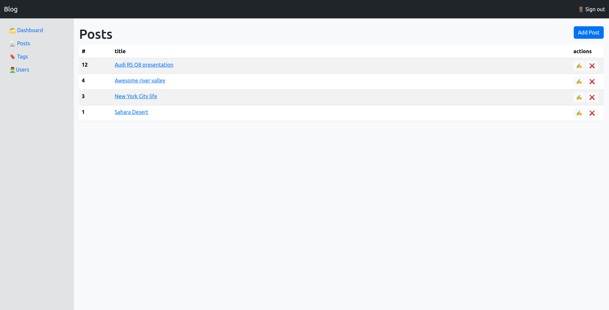
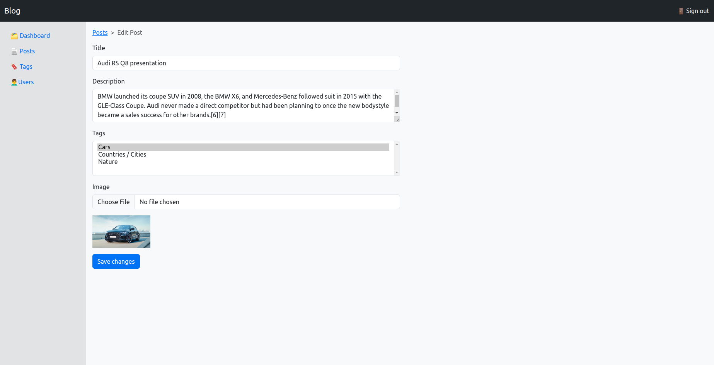
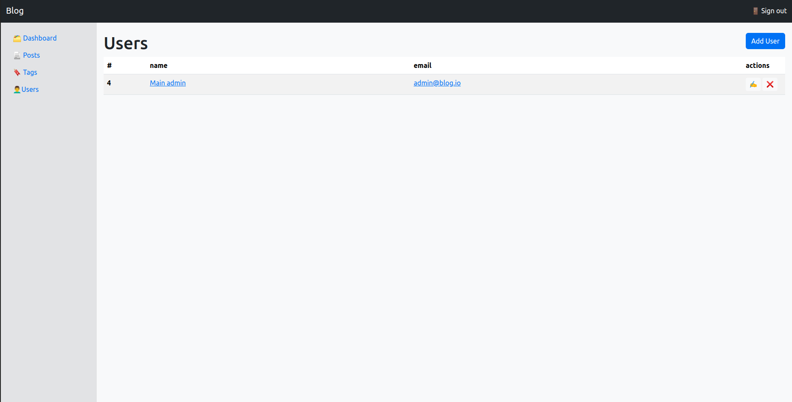
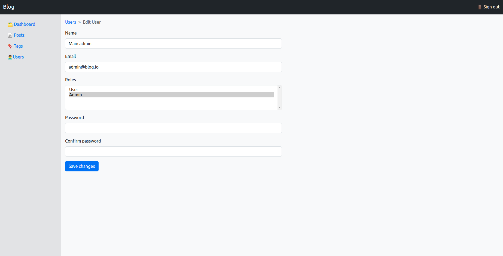
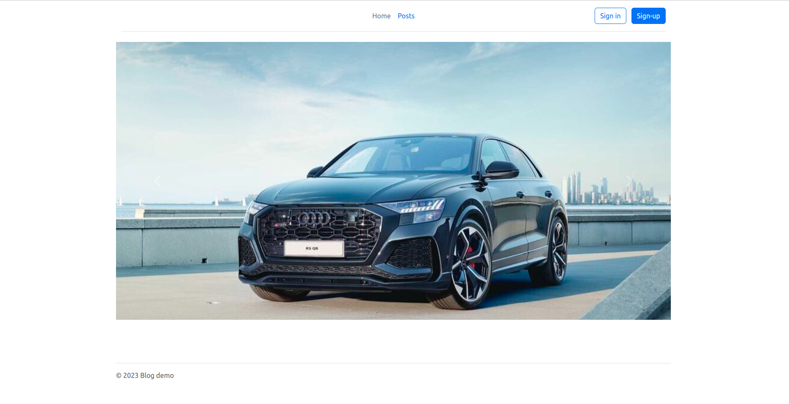
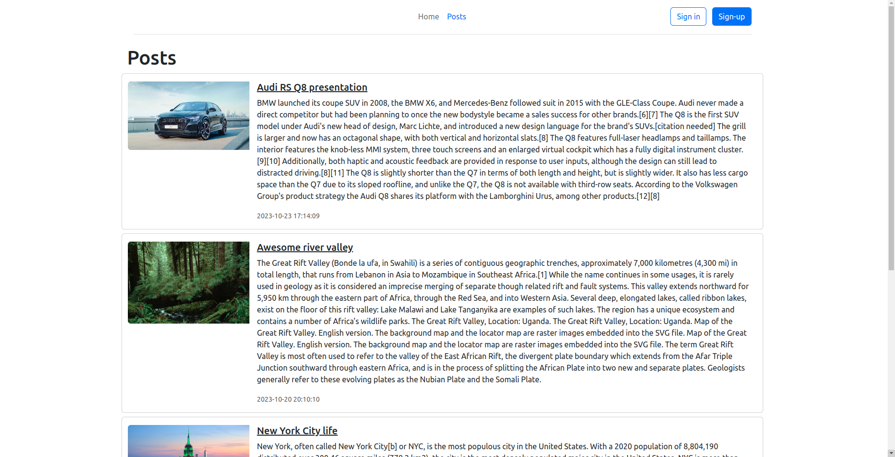
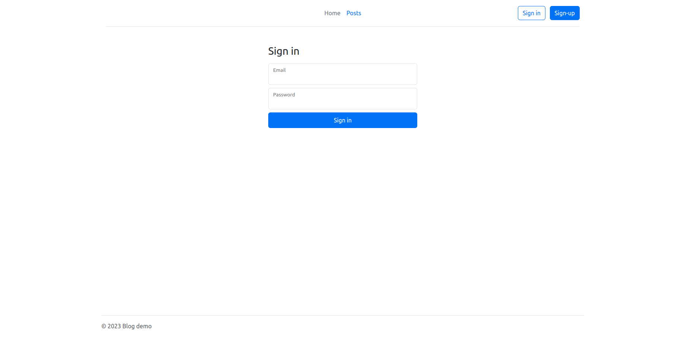
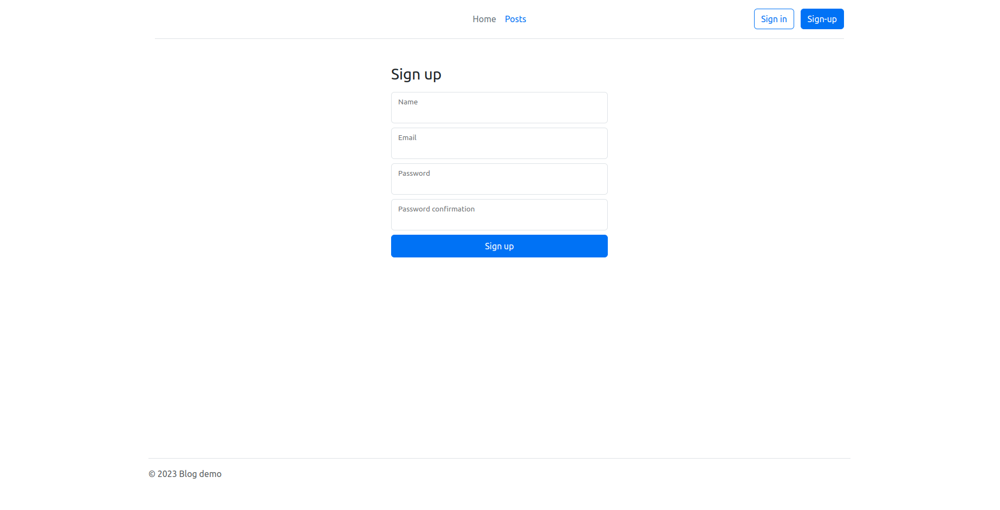

# Laravel 10 Blog Demo

## Admin panel

#### Screenshot for Post list


#### Screenshot for Post edit


#### Screenshot for User list


#### Screenshot for User edit



## Front

#### Screenshot for Home


#### Screenshot for Post list


#### Screenshot for Sign in


#### Screenshot for Sign up



## Steps to run web site

Copy and edit the env file

```
  cp .env.example .env
```

Install libs
```
  composer install
```

Run local server
```
  php artisan serve
```
